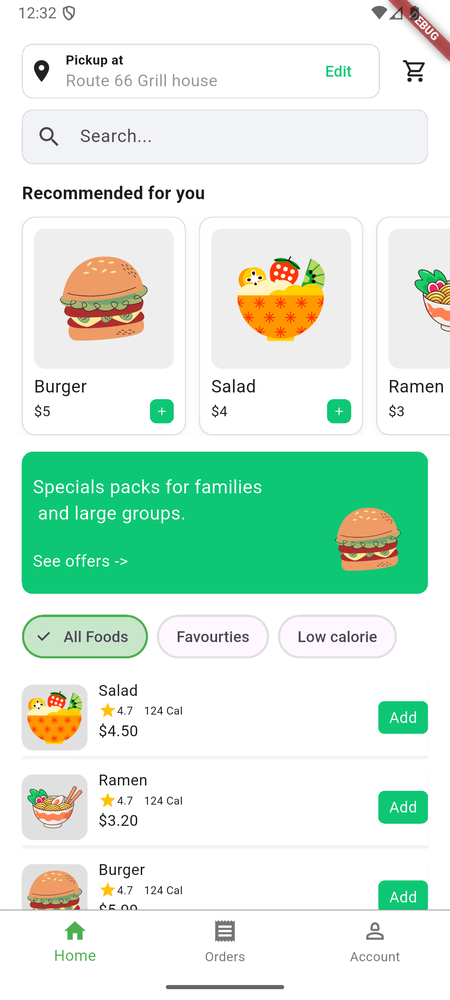
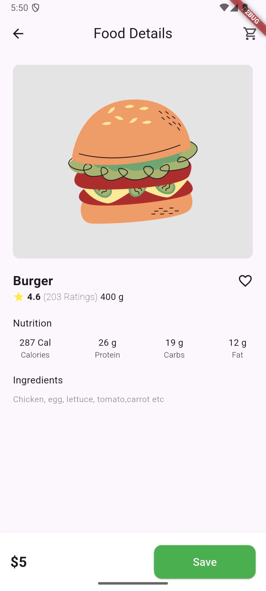

# 🍔 Quick Bite UI – Flutter  

This is a Flutter project showcasing **two UI screens** of the **Quick Bite App** inspired by a design on [Dribbble](https://dribbble.com/).  
It’s part of my **Flutter learning journey**, focusing on building beautiful and responsive UI.  

---

## ✨ Features
- 📱 Two screens UI design  
- 🎨 Inspired by Dribbble’s Quick Bite design  - https://dribbble.com/shots/23365286-Quick-Bite-Food-ordering-app
- ⚡ Built using **Flutter** with clean and reusable widgets  
- 🚀 Beginner-friendly structure for practice  

---

## 📸 Screenshots  
### Home Screen  
<p align="center">
  
  
</p>

---

## 🛠️ Tech Stack
- **Flutter** (UI toolkit by Google)  
- **Dart** (programming language)  

---

## 📂 Project Structure
lib/
├── main.dart
├── screens/
│ ├── screen1.dart
│ └── screen2.dart
└── widgets/
└── reusable_widgets.dart


---

## 🚀 Getting Started  

### 1️⃣ Prerequisites
- Install [Flutter](https://docs.flutter.dev/get-started/install)  
- Install [Dart SDK](https://dart.dev/get-dart)  
- Any IDE like **Android Studio**, **VS Code**, or **IntelliJ IDEA**  

### 2️⃣ Clone the repository
```bash
git clone https://github.com/AnweshaPal26/Quick_Bite-FlutterUI.git
cd quick-bite-ui
```

### 3️⃣ Install dependencies
```bash
flutter pub get
```

### 4️⃣ Run the app
``` bash
flutter run
```

### 📖 Learning Purpose

This project is not a production-ready app.
It’s built to practice Flutter UI development and improve my design-to-code skills.

### 🙌 Acknowledgements

UI Inspiration: Quick Byte App on Dribbble - https://dribbble.com/shots/23365286-Quick-Bite-Food-ordering-app

Flutter Documentation: flutter.dev

### 📜 License

This project is open-source and available under the MIT License
.


